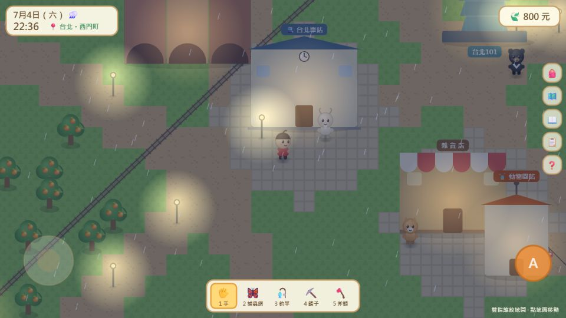
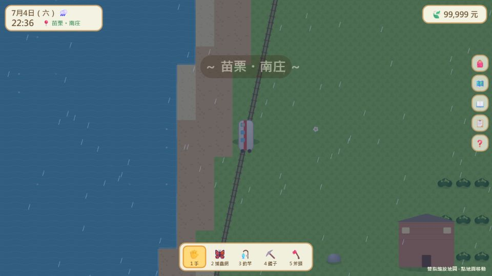

# 我的小世界：台灣島物語 🏝️

一款動物森友會風格的網頁小遊戲，地圖就是**台灣**！
純 HTML5 Canvas 打造，零依賴、單機執行，**電腦手機都能玩**。

**▶ 立即遊玩：https://sancola1219-collab.github.io/taiwan-island-life/**

## 特色

### 📱 全平台操作
- **手機**：左下虛擬搖桿移動、右下 Ⓐ 鍵互動、雙指縮放地圖、右側圖示一鍵開背包/地圖/圖鑑/任務（建議橫向遊玩）
- **滑鼠**：按住地面朝方向移動、點擊互動、滾輪縮放
- **鍵盤**：WASD 移動、空白鍵互動、快捷鍵齊全

### 🗺️ 超大擬真台灣地圖（600×780 格）
- 照真實台灣輪廓繪製：中央山脈、日月潭、嘉南平原稻田、環島沙灘
- **10 座離島**：澎湖（馬公/西嶼/吉貝/七美）、金門、馬祖、小琉球、綠島、蘭嶼、龜山島
- **129 個真實鄉鎮**：每個縣市都有各自的區——新北就有鶯歌、三峽、九份、平溪、金山、瑞芳、淡水、烏來…走到哪顯示到哪
- **75+ 個真實景點**：鶯歌陶瓷老街、大溪老街、高跟鞋教堂、故宮南院、安平古堡、鵝鑾鼻燈塔、三仙台八拱橋、清水斷崖、澎湖跨海大橋、綠島朝日溫泉、蘭嶼拼板舟……

### 🚂 火車環島（看得到火車跑！）
地圖上畫有**環島鐵路軌道**，13 個車站買票上車後，火車**真的沿著鐵軌開到目的地**，
沿途看海岸、稻田、城鎮風景，區域名稱隨站更新（點擊可加速）。

### 🚡 纜車 & 🎈 熱氣球
- **貓空纜車**（動物園站⇄貓空站）、**日月潭纜車**（伊達邵⇄九族）：吊在空中纜線上滑行
- **鹿野高台熱氣球**：升空後鏡頭拉高，鳥瞰整片花東縱谷再降落

### ⛵ 搭船環島
- 港口買船（3,000元）自由航行全海域，18 個港口渡輪航線互通離島
- 船上海釣限定：飛魚、旗魚、黑鮪魚、超稀有鯨鯊！

### 🐻 台灣動物村民 & 收集
- 18 位台灣動物村民（台灣黑熊、石虎、雲豹、帝雉、黑面琵鷺、蘭嶼角鴞、綠島梅花鹿…）、9 個委託任務
- 17 種魚、11 種昆蟲圖鑑（蘭嶼限定珠光鳳蝶、茂林紫斑蝶！）
- 採集地圖：北部橘子、南部芒果蓮霧、台東釋迦、**大湖草莓**、阿里山採茶、澎湖仙人掌果
- 六十石山金針花海、新社花海、溫泉、天燈、夜市、廟宇抽籤…
- 真實時間晝夜 + 隨機下雨，晚上有螢火蟲和路燈亮起

## 操作一覽

| 平台 | 移動 | 互動 | 縮放 | 功能 |
|---|---|---|---|---|
| 📱 手機 | 左下搖桿 / 點地面 | Ⓐ 鍵 / 點自己附近 | 雙指開合 | 右側圖示 |
| 🖱️ 滑鼠 | 按住地面 | 點擊附近目標 | 滾輪 | 點擊工具列 |
| ⌨️ 鍵盤 | WASD / 方向鍵（Shift 跑）| 空白鍵 / E | — | B背包 M地圖 P圖鑑 J任務 H說明 N音樂 |

進度自動儲存在瀏覽器（localStorage）。

## 本機執行

直接用瀏覽器打開 `index.html` 即可，不需安裝任何東西。

## 技術

- 純 vanilla JavaScript + Canvas 2D，無外部依賴
- 程序化地圖生成（多邊形海岸線 + 值噪聲 + 山脈脊線），468k 圖塊
- 統一的乘坐系統（火車/纜車/熱氣球共用路徑跟隨）
- Pointer Events 統一滑鼠/觸控，含虛擬搖桿與雙指縮放
- `data.js` 為純資料層——鄉鎮、景點、鐵路、航線、任務全部資料驅動，想加內容改這裡就行

## 授權

MIT License
