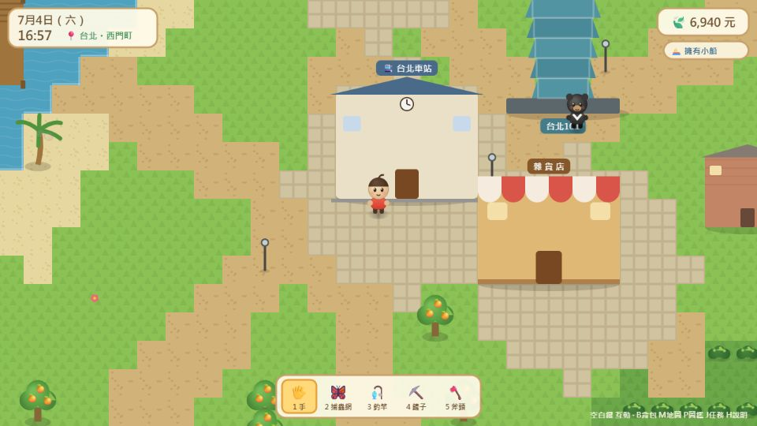
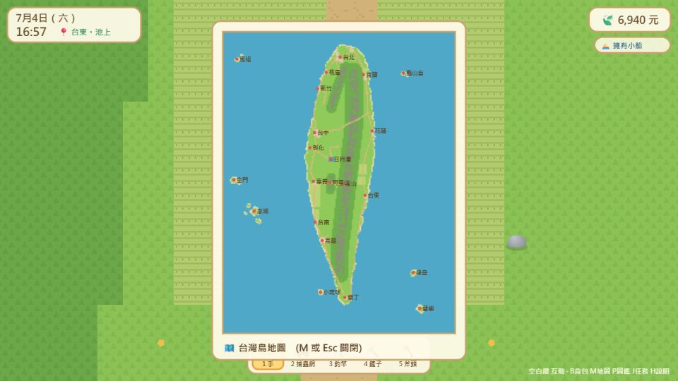
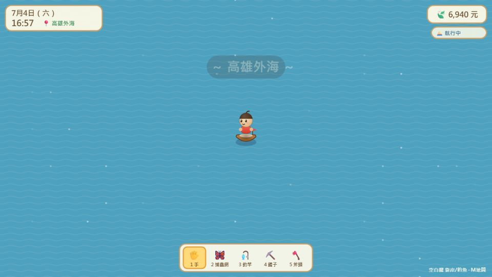
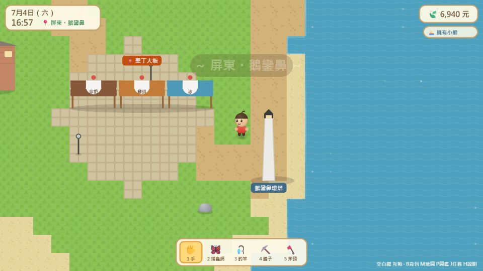
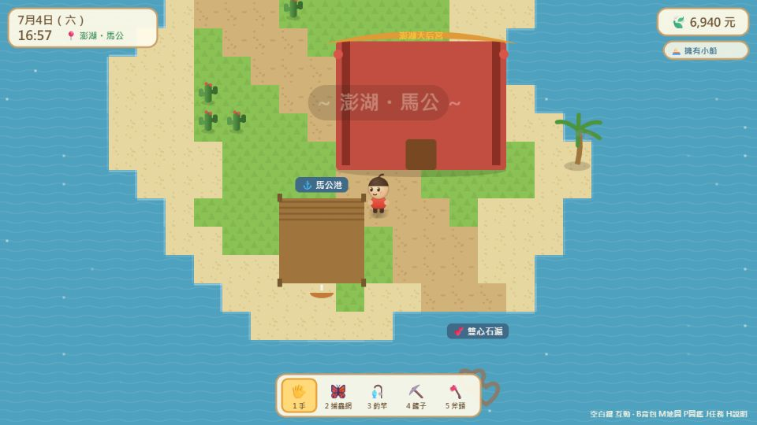

# 我的小世界：台灣島物語 🏝️

一款動物森友會風格的網頁小遊戲，地圖就是**台灣**！
純 HTML5 Canvas 打造，零依賴、單機執行，打開就能玩。

**▶ 立即遊玩：https://sancola1219-collab.github.io/taiwan-island-life/**

## 特色

### 🗺️ 超大擬真台灣地圖
- 400×520 格的大地圖，照真實台灣輪廓繪製：中央山脈、日月潭、嘉南平原稻田、環島沙灘
- **7 大離島**：澎湖、金門、馬祖、小琉球、綠島、蘭嶼、龜山島
- **50+ 個真實鄉鎮**：走到哪顯示到哪——桃園・大溪、宜蘭・羅東、新北・九份、屏東・墾丁…
- 真實地標：台北101、台中歌劇院、安平古堡、赤崁樓、八卦山大佛、鵝鑾鼻燈塔、高美濕地風車、阿里山神木、玉山主峰、野柳女王頭、澎湖雙心石滬…

### ⛵ 搭船環島
- 到任一港口買一艘小船（3,000元），就能**自由航行全海域**，開去離島探險！
- 各港口有**渡輪航線**：東港→小琉球、富岡→綠島/蘭嶼、高雄→澎湖、基隆→馬祖…
- **船上海釣**限定漁獲：飛魚、旗魚、黑鮪魚，還有超稀有的鯨鯊！

### 🚉 火車環島
12 個車站（台北、桃園、新竹、台中、嘉義、台南、高雄、枋寮、台東、花蓮、羅東、基隆）快速旅行。

### 🐻 台灣動物村民 & 任務
台灣黑熊、石虎、梅花鹿、台灣藍鵲、黑面琵鷺、白海豚、雲豹、帝雉、蘭嶼角鴞……
17 位村民散布全島，8 個委託任務等你完成！

### 🎣 收集與體驗
- 17 種魚（日月潭限定櫻花鉤吻鮭！）、10 種昆蟲（蘭嶼限定珠光鳳蝶！）
- 搖樹採果：北部橘子、中部香蕉、南部芒果蓮霧、台東釋迦、山區水蜜桃、澎湖仙人掌果
- 阿里山採茶、礁溪泡溫泉、平溪放天燈、鹿野搭熱氣球、媽祖廟抽籤詩、夜市吃小吃
- 真實時間晝夜變化 + 隨機下雨，晚上有螢火蟲和獨角仙

## 操作

| 按鍵 | 功能 |
|---|---|
| WASD / 方向鍵 | 移動（Shift 奔跑） |
| 空白鍵 / E | 互動・使用工具・上下船 |
| 1~5 | 切換工具（手/捕蟲網/釣竿/鏟子/斧頭） |
| B | 背包 |
| M | 地圖 |
| P | 生物圖鑑 |
| J | 任務清單 |
| H | 遊戲說明 |
| N | 音樂開關 |

進度自動儲存在瀏覽器（localStorage）。

## 本機執行

不需要安裝任何東西——直接用瀏覽器打開 `index.html` 即可。

## 技術

- 純 vanilla JavaScript + Canvas 2D，無任何外部依賴
- 程序化地圖生成（多邊形海岸線 + 值噪聲 + 山脈脊線）
- WebAudio 合成音樂與音效
- `data.js` 為純資料層（鄉鎮、地標、航線、任務都是資料驅動），想擴充地圖內容改這裡就行

## 授權

MIT License
